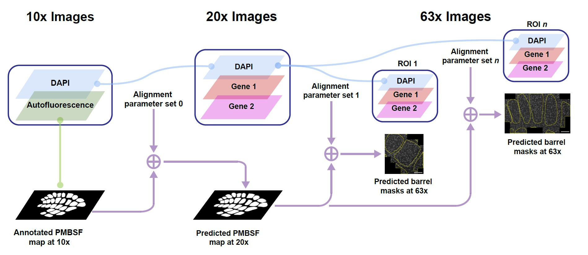

# IPy9R

[](https://github.com/annaxluo/IPy9R/actions/workflows/ci-light.yml)
[](https://www.gnu.org/licenses/gpl-3.0)

`IPy9R` is a Python package that contains the image-processing workflows in my thesis project to quantify smFISH data. The package currently supports three main analyses:

1. **Image alignment**
- Estimate a model to project lower-magnification images (e.g., 10x) to higher-magnification images (e.g., 63x) using multi-scale template matching followed by perspective transformation. 
- Transform annotations of barrels in the mouse posteromedial barrel subfield (PMBSF) made in lower-magnification images to barrel mask for higher-magnification images.

2. **Cell counting**
- Preprocess images for `CellProfiler` by creating tiles.
- Combine `CellProfiler` tile outputs, and aggregate counts of DAPI-positive nuclei and specific cell types (e.g., microglia) inside each barrel of the PMBSF.
- Compute cell density and cell-to-nuclei ratios for each barrel. 

3. **mRNA spot counting**
- Make data structure for confocal image data compatible for `Starfish`.
- Detect mRNA puncta using `BlobDetector` in `Starfish`.
- Count spots inside individual barrels.
- Summarize spot counts across ROIs and experiments.

The package uses a `src/` layout and is configured through YAML files in the `configs/` directory.

---

## Installation

### 1. Clone the repository

```bash
git clone https://github.com/annxluo/IPy9R.git
cd IPy9R
```

### 2. Create a virtual environment

Using Conda:

```bash
conda create -n ipy9r python=3.10
conda activate ipy9r
```

### 3. Install the package

Installing the base functions: 

```bash
pip install -e .
```

Additional optional packages are required for some functions, such as `OpenCV`, `Starfish`, and `SlicedImage`.

To install alignment dependencies:

```bash
pip install -e ".[alignment]"
```

To install cell-counting dependencies:

```bash
pip install -e ".[cell-count]"
```

To install mRNA-counting dependencies:

```bash
pip install -e ".[mrna-count]"
```

To install all optional workflow dependencies: 
```bash
pip install -e ".[all]"
```

---

## Configuration files

The package can be run from YAML configuration files.

The main example config files are:

```text
configs/alignment.yaml
configs/cell_count.yaml
configs/mrna_count.yaml
```

Modify inputs in these configuration files. 

---

## Task 1: Image alignment

To evaluate gene expression in the mouse posteromedial barrel subfield (PMBSF), we identified a method to method to delineate barrel boundaries using autofluorescence signal in the GFP channel in 10x images acquired on a widefield microscope. 

However, green autoflourescence was weaker at the higher resolutions (e.g., 20x, 63x) at which the smFISH signals were detected. To **enable identification of barrel boundaries at higher resolutions**, I designed an image process pipeline that includes the following steps: 
- Takes in fluorescence images of the same channel (e.g., DAPI) acquired at low and high resolution, and estimate the best scaling factor for the low-resolution image via **multi-scale template matching**. 
- Scales the low-resolution image, and estimate the **perspective transformation** matrix that project the low-resolution image to high-resolution image. 
- Applies the optimal scaling factor and perspective transformation matrix (defined as an "Alignment Parameter Set") to barrel annotations (binary masks of individual barrels) made a low resolution to estimate barrel masks at high resolution. 

<p align="center">
  
</p>

### 1.1 Update `alignment.yaml`

The config file for this step is: 
```text
configs/alignment.yaml
```
Important fields:

| Field | Description |
|---|---|
| `alignment.param_fn` | Output JSON file where alignment parameters are stored. |
| `alignment.image_fn` | Path to high-resoltution image. |
| `alignment.template_fn` | Path to lower-resolution template. |
| `alignment.val_output_dir` | Directory for validation images. |
| `alignment.init_mask_coords` | Initial template mask coordinates as `[Y, X, H, W]` to restrict search region. Use `null` for default. |
| `alignment.scale_min`, `alignment.scale_max` | Search range for scale matching. |
| `transform_masks.mask_dir` | Directory containing barrel masks at low resolution. |
| `transform_masks.used_masks` | Mask IDs to transform. |
| `transform_masks.boundary_mask_fn` | Binary mask defining the valid target image boundary (created by tiling). |
| `transform_masks.output_dir` | Output directory to store transformed masks at high resolution. |

### 1.2 Run template matching

```bash
ipy2r-run-template-matching --config configs/my_alignment.yaml
```

This step writes alignment parameters to:

```text
alignment.param_fn
```

and validation images to:

```text
alignment.val_output_dir
```

Inspect the validation outputs before proceeding.


### 1.3 Transform barrel masks

```bash
ipy2r-transform-masks --config configs/my_alignment.yaml
```

This step reads the masks listed under `transform_masks.used_masks`, transforms them using the saved alignment parameters, applies the image boundary mask, and saves the transformed masks to:
```text
transform_masks.output_dir
```


## Task 2: Cell counting

The package includes utilities to count the number of DAPI-positive nuclei and a marker-based cell type using `CellProfiler`, and compute the cell density and cell-to-nuclei ratio for individual barrels. 

The related config file is: 
```text
configs/cell_count.yaml
```

### 2.1 Update `cell_count.yaml`

Important fields:

| Field | Description |
|---|---|
| `shared.data_path` | Base path for data. |
| `shared.stack_str` | Stack identifier, for example `stack01`. |
| `shared.slide_id` | Slide ID. |
| `shared.nuclei_ch` | DAPI/nuclei channel ID. |
| `shared.rna_ch` | RNA/cell-marker channel ID. |
| `shared.mask_stack` | Barrel mask IDs to include. |
| `preprocess_cellprofiler.max_h` | Maximum tile height for CellProfiler inputs. |
| `preprocess_cellprofiler.max_w` | Maximum tile width for CellProfiler inputs. |
| `compute_stats.spared_deprived_groups_fn` | JSON file assigning barrels to spared/deprived groups. |

Expected input structure under `data_path`:

```text
<data_path>/
├── CP_inputs/
│   ├── C3-<slide_id>-<stack_str>.tif
│   └── C1-<slide_id>-<stack_str>.tif
├── CP_outputs/
└── output_masks/
    ├── B2_transformed.tif
    ├── B3_transformed.tif
    └── ...
```

### 2.2 Preprocess images for CellProfiler

Create smaller tiles from fluorescence images for RAM-constrained systems: 

```bash
ipy2r-preprocess-cellprofiler --config configs/my_cell_count.yaml
```

This creates image tiles under:

```text
<data_path>/CP_inputs/image_tiles_<stack_str>/
```

The tile metadata file should be:

```text
<data_path>/CP_inputs/image_tiles_<stack_str>/<nuclei_ch>-<slide_id>-<stack_str>_tiles.csv
```

### 2.3 Run CellProfiler externally

After preprocessing, run the appropriate CellProfiler pipeline outside this package.

The expected CellProfiler output file is:

```text
<data_path>/CP_outputs/<stack_str>_Nuclei_obj.csv
```

### 2.4 Analyze CellProfiler nuclei outputs

```bash
ipy2r-analyze-cellcount --config configs/my_cell_count.yaml
```

This step:
1. Combines tile-level CellProfiler outputs.
2. Selects nuclei inside transformed masks.
3. Writes visualization and CSV outputs.

Expected outputs include:

```text
<data_path>/CP_outputs/<stack_str>_Nuclei_obj_combinedTiles.csv
<data_path>/CP_outputs/<stack_str>_Nuclei_obj_inMask.tif
<data_path>/CP_outputs/<stack_str>_Nuclei_obj_inMask.csv
```

### 2.5 Manually curate nuclei selections 

If manual curation is needed, edit/export the curated nuclei file as:

```text
<data_path>/CP_outputs/<stack_str>_Nuclei_obj_inMask_v2.csv
```

This file is used by the statistics step.

### 2.6 Compute statistics for barrels

Compute statistics, including cell density, and cell-to-nuclei ratio, for each barrel: 
```bash
ipy2r-compute-stats --config configs/my_cell_count.yaml
```

This step expects:
```text
<data_path>/CP_outputs/<stack_str>_Nuclei_obj_inMask_v2.csv
<data_path>/CP_outputs/CellCount_<rna_ch>-<slide_id>-<stack_str>.csv
```

Outputs include:
```text
<data_path>/CP_outputs/<stack_str>_cell_inMask_summary.csv
<data_path>/CP_outputs/<stack_str>_cell_ratio_inMask_summary.csv
```

## Task 3: mRNA spot counting

The package also includes utilities to quantify mRNA puncta from smFISH images using `Starfish`: 

1. Structure data for Starfish.
2. Detect mRNA spots using `BlobDetector` in `Starfish`.
3. Summarize spots inside barrel masks for each ROI.
4. Summarize spots across the experiment.

The relevant config file is:
```text
configs/mrna_count.yaml
```

### 3.1 Update `mrna_count.yaml`

Important fields:

| Field | Description |
|---|---|
| `data_path_base` | Base experiment directory. |
| `roi_folder_prefix` | Prefix used for ROI folders, for example `confocal_63x_`. |
| `roi_list` | ROI IDs to process. |
| `used_channels` | Image channels used for mRNA counting. |
| `channel_gene_names` | Gene names corresponding to `used_channels`. |
| `image_id_list` | Image IDs for each ROI. |
| `used_z_list` | Z-plane index for each ROI. |
| `selection_rect` | Optional crop rectangle for each ROI. Use `null` for no crop. |
| `z_thickness` | Z thickness used in `Starfish` coordinate metadata. |
| `min_sigma`, `max_sigma`, `num_sigma` | Blob detector parameters. |
| `search_radius` | Spot detector search radius. |
| `otsu_n_classes` | Number of Otsu classes used to derive intensity thresholds for spot filtering in `BlobDetector`. |
| `roi_area_thresh` | Minimum ROI overlap ratio for including a barrel for the ROI. |
| `mask_suffix` | Suffix for transformed mask files. |
| `spared_deprived_groups_fn` | JSON file assigning barrels to spared/deprived groups. |

Expected input structure:

```text
<data_path_base>/
├── roi_summary.csv
├── confocal_63x_ROI1/
│   ├── CP_inputs/
│   │   ├── C2-image1-0003.tif
│   │   └── C4-image1-0003.tif
│   └── output_masks/
│       ├── B2_transformed.tif
│       └── ...
├── confocal_63x_ROI2/
│   └── ...
└── SF_analysis/
```

### 3.2 Structure data for Starfish

```bash
ipy2r-structure-data --config configs/my_mrna_count.yaml
```

This step creates structured Starfish input data under:

```text
<data_path_base>/SF_analysis/
```

### 3.3 Detect mRNA spots

```bash
ipy2r-detect-mrna-spots --config configs/my_mrna_count.yaml
```

This step loads the Starfish experiment, preprocesses images, computes thresholds, detects spots, and writes detection outputs. We use the OTSU's method to estimate the `threshold` parameter for `BlobDetector`. 

Expected output folders:

```text
<data_path_base>/SF_analysis/SF_outputs/preprocess_outputs/
<data_path_base>/SF_analysis/SF_outputs/threshold_outputs/
<data_path_base>/SF_analysis/SF_outputs/detection_outputs/
```

Example detection outputs:

```text
thresh0-f0-c0-r0-z0.csv
thresh0-f0-c0-r0-z0.tiff
thresh1-f0-c1-r0-z0.csv
```

The step also updates the threshold parameters in:

```text
<data_path_base>/SF_analysis/data_structure.json
```

### 3.4 Summarize spots inside barrel masks

```bash
ipy2r-summarize-spots-barrels --config configs/my_mrna_count.yaml
```

This step applies transformed barrel masks to detected spots and computes the spot count and density per barrel.

Expected output folder:

```text
<data_path_base>/SF_analysis/SF_outputs/mask_outputs/
```

Example outputs:

```text
thresh0-f0-c0-r0-z0.csv
thresh0-f0-c0-r0-z0.tif
```

### 3.5 Summarize spots across the experiment

```bash
ipy2r-summarize-spots-experiment --config configs/my_mrna_count.yaml
```

This step combines ROI-level and barrel-level spot counts across the experiment.

Expected output:

```text
<data_path_base>/SF_analysis/SF_outputs/experiment_counts.csv
```

---

## Spared/deprived barrel groups

Both the cell-counting and mRNA-counting workflows can use a JSON file defining spared and deprived barrels: 

```json
{
  "spared": ["B2", "B3", "C2", "C3"],
  "deprived": ["D1", "D2", "D3"]
}
```

The default path used in the example configs is:

```text
configs/spared_deprived_barrels.json
```

## License

GPL (>= 3)

## Author

Anna Luo
